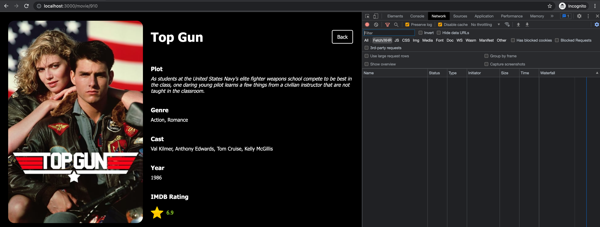

# 🚀 The Cruise Strikes Back App!

- [Remix Docs](https://remix.run/docs)

## Setup & Development

From your terminal install all dependencies:

```sh
yarn
```

Then run

```sh
yarn dev
```

This starts your app in development mode, rebuilding assets on file changes.

## Deployment

First, build your app for production:

```sh
npm run build
```

Then run the app in production mode:

```sh
npm start
```

Now you'll need to pick a host to deploy it to.

## Requirements

- Node >= 16

## 🛠 Stack

I have decided to go with Remix.run [Remix.run](https://remix.run/) to experiment with this framework (I have used this test as an opportunity to learn this framework due to ex-colleagues).

Thanks to Remix.run the following features is availabe:

- Zero config: Quick and easy to setup
- SSR: yes server-side rendering. For a movie application it is vital that we have `<meta> and <title> tags`
- Nested routing

### Things I have added

I have set up Full integration with Apollo client and remix.run This ensures the following:

- Blazing fast GraphQL requests
- Client-side cache and rehydration of state with server side cache
- [React autosuggest](https://react-autosuggest.js.org/) with debounce in order to reduce load on the server and client.
- Fetching on the serverside for movies i.e. `/movie/{id}` is fetched on the server. This can be verified by opening up devtools and checking the network requests tab. You should not see any requests because the data is fetched on the server.



## Other Features

- Typescript
- React Functional Components
- Hooks
- CSS with no preprocessors (Remix has a weird way of injecting styles)
- Simple and scalable UI

## Things that can be improved

- Needs Testing (unit, e-2-e)
- CSS can be improved
- Containerization of application i.e. dockerfile
